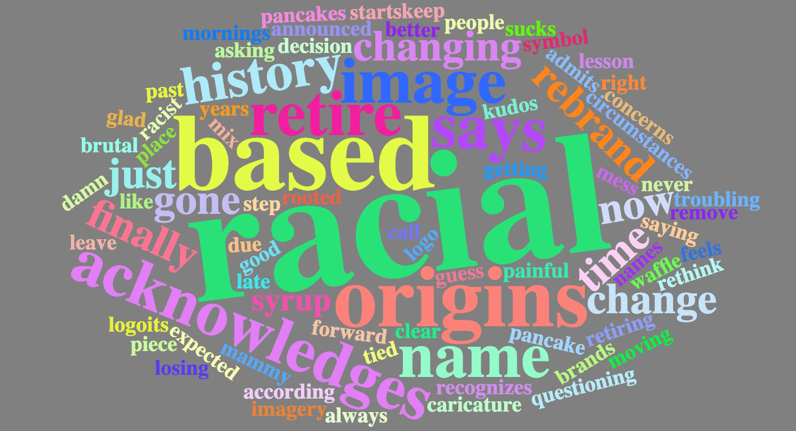
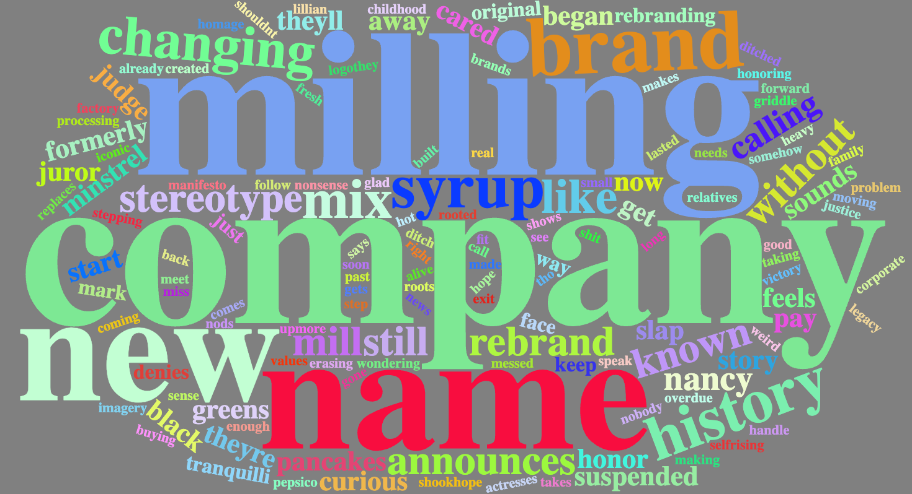
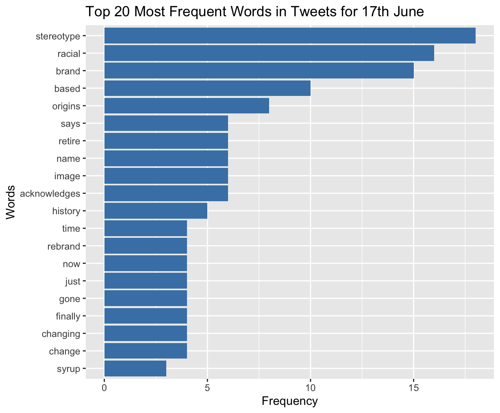
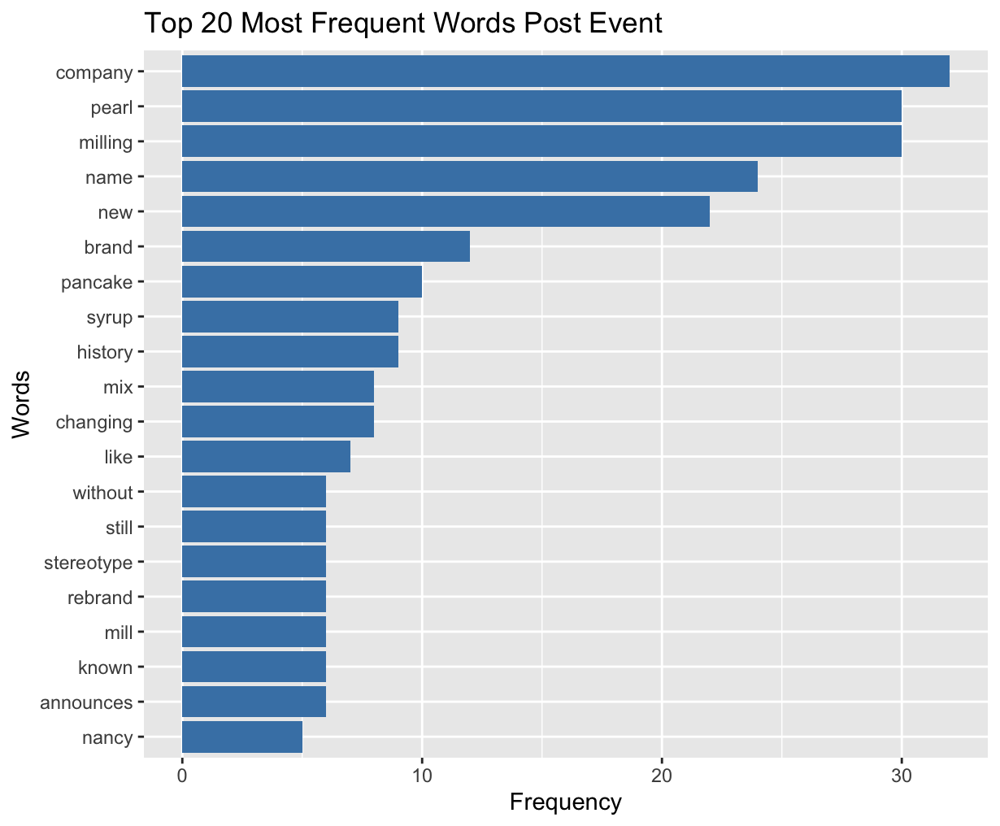
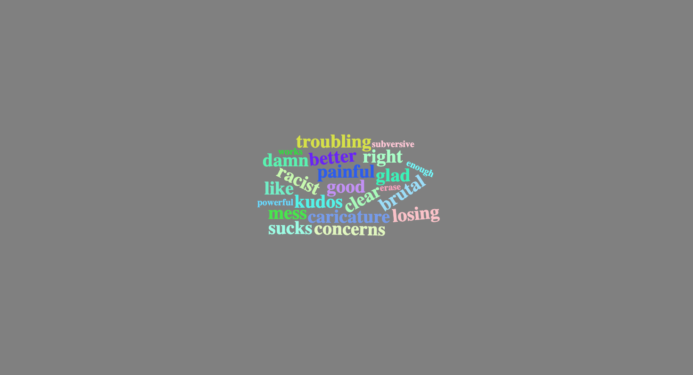
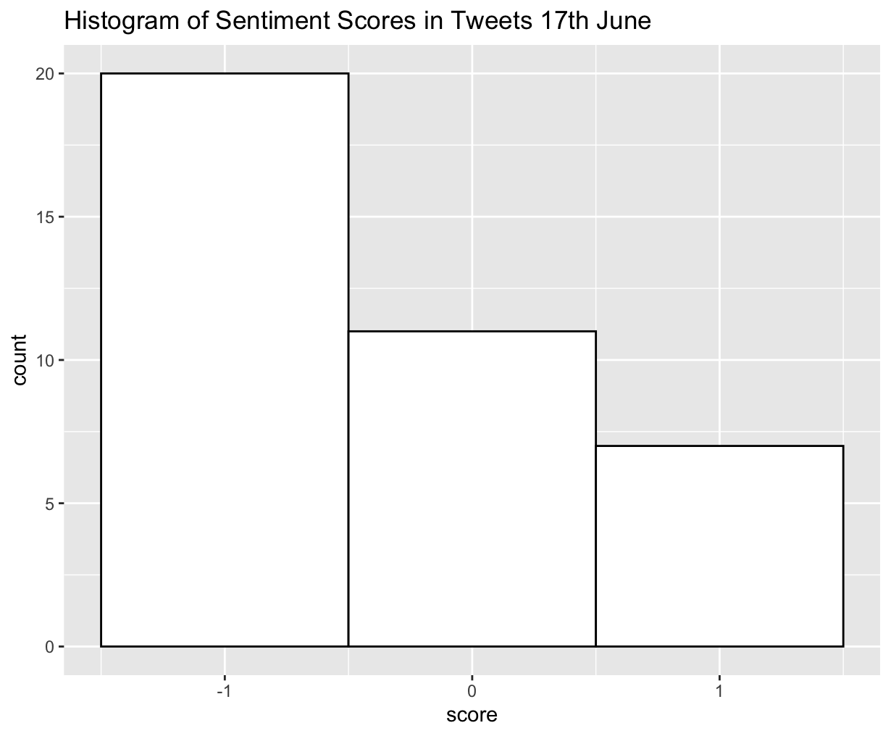
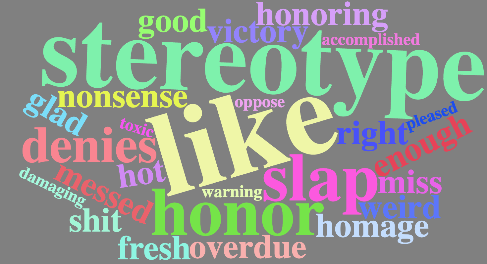
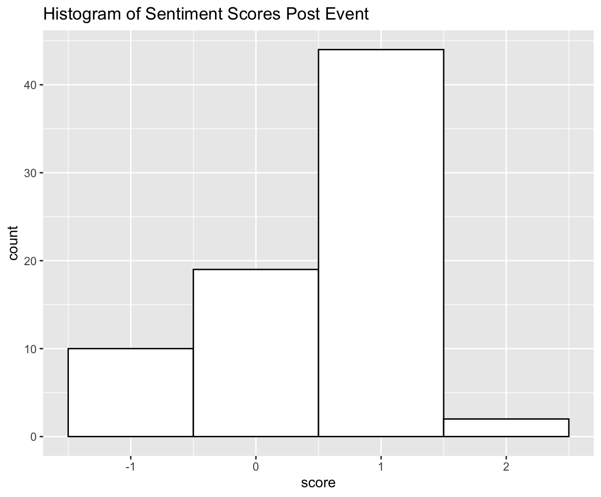

# 🥞 Aunt Jemima Rebrand — Digital Marketing Analytics

A marketing analytics case study evaluating the impact of Aunt Jemima’s rebranding to Pearl Milling Company using Difference-in-Differences modeling, sentiment analysis, and event-driven stock analysis.

---

## 🧠 Business Context

On June 17, 2020, PepsiCo’s Quaker Oats announced it would retire the Aunt Jemima brand — a long-standing symbol criticized for racial stereotyping — and rebrand it as the Pearl Milling Company. The decision was part of a broader wave of corporate responses to racial justice movements. This project investigates how this rebranding effort influenced sentiment, brand equity, investor perception, and sales performance.

---

## 🛠️ Tools Used

- **Radiant (R)** – for modeling Difference-in-Differences (DiD) sales impact  
- **R** – for sentiment scoring, word clouds, and tweet frequency visualizations  
- **Excel** – for abnormal return analysis and stock comparison  
- **PowerPoint** – for visual storytelling  
- **Public Datasets** – Twitter, Stock Market, and Sales Data

---

## 🔧 My Role

I contributed to multiple phases of the project:
- Conducted sentiment and frequency analysis of tweets pre- and post-rebrand
- Modeled sales impact using DiD methodology in Radiant
- Evaluated stock performance and abnormal returns in Excel
- Interpreted and visualized changes in public discourse through histograms and word clouds
- Presented findings in a clear, business-focused narrative

---

## 📊 Analytical Outputs

### 💬 Word Clouds

| Word Cloud – Event Day (June 17) | Word Cloud – Post Event |
|----------------------------------|--------------------------|
|  |  | 

### 🔠 Top 20 Most Frequent Words

| 17th June | Post Event |
|-----------|------------|
|  |  |

### 📈 Sentiment Distribution & Score Histograms

| Sentiment Scores (June 17) | Score Histogram (June 17) |
|----------------------------|---------------------------|
|  |  |

| Sentiment Scores (Post Event) | Score Histogram (Post Event) |
|-------------------------------|-------------------------------|
|  |  |

---

## 📈 Key Findings

- **Sales Decline**: Aunt Jemima experienced a drop of ~3,785 units in average sales post-event compared to competitors (DiD model).
- **Sentiment Shift**: Negative sentiment (anger, fear) was high on June 17, but positive and trust-related tones grew afterward.
- **Stock Reaction**: PepsiCo’s stock fell 3.41% during the event window — underperforming NASDAQ by 2.65%. However, abnormal return was slightly positive at +0.14%, indicating limited long-term concern.
- **Public Discourse**: Tweets transitioned from emotionally charged words like “racial,” “stereotype,” and “painful” to neutral/adaptive terms like “company,” “milling,” and “new.”

---

## 📁 Files Included

| File | Description |
|------|-------------|
| `Final Report.pdf` | Full analytics report including event study and interpretation |
| `AuntJemimaDID.pptx` | Visual slide deck of key findings |
| `Tweets.xlsx` | Pre- and post-event Twitter dataset |
| `Stock Performance.xlsx` | Stock return and comparison data |
| `*.png` files (in `images/`) | All sentiment plots, word clouds, and histograms

---

## ✅ Key Learning Outcomes

- Gained experience applying **DiD methodology** to real-world brand events  
- Performed **sentiment mining and visualization** using R  
- Assessed **investor response** via abnormal return modeling  
- Translated raw data into actionable business insights and visual stories

---

## 🔗 Let’s Connect

💼 [LinkedIn](https://linkedin.com/in/armashaik)  
📂 [More Projects](https://github.com/armashaik)
